# Growth Lab Deep Search - Project Status

*Generated: July 23, 2025*

## Executive Summary

The Growth Lab Deep Search project is at a **critical transition point**. The foundational ETL pipeline components are largely complete and functional, with the **PDF processing MVP ready for production use**. The immediate next step is implementing the **chunking and embeddings system** to enable semantic search capabilities.

## Current Project Structure

### Core ETL Components Status

| Component | Status | Implementation | Key Files |
|-----------|--------|----------------|-----------|
| **Lecture Transcripts** | ✅ Complete | Fully implemented with LLM processing | `backend/etl/scripts/run_lecture_transcripts.py` |
| **Growth Lab Scraper** | ✅ Complete | Publication metadata extraction | `backend/etl/scrapers/growthlab.py` |
| **Growth Lab File Downloader** | ✅ Complete | PDF download with retry logic | `backend/etl/utils/gl_file_downloader.py` |
| **PDF Processing** | ✅ **Ready for Production** | OCR, text extraction, batch processing | `backend/etl/utils/pdf_processor.py` |
| **OpenAlex Integration** | ⏸️ Paused | File downloader implementation exists | `backend/etl/utils/oa_file_downloader.py` |
| **Chunking & Embeddings** | 🔴 **Missing** | Config exists, implementation needed | Configuration in `backend/etl/config.yaml` |
| **Vector Database** | 🔴 **Missing** | Dependencies installed, implementation needed | Qdrant configured in config |
| **ETL Orchestrator** | 🟡 **Partial** | Pipeline coordination, **missing Docker & cloud deployment** | `backend/etl/orchestrator.py` |

## Detailed Component Analysis

### 1. PDF Processing System - **PRODUCTION READY** ✅

**Implementation**: `backend/etl/utils/pdf_processor.py` (328 lines)
- **OCR Engine**: Uses `unstructured` library with configurable strategies
- **Language Support**: Multi-language OCR (`ocr_languages: ["eng"]` configurable)
- **Batch Processing**: Concurrent processing with progress tracking
- **Error Handling**: Comprehensive error handling with meaningful logging
- **Output Structure**: Preserves document structure (titles, tables, lists, page numbers)
- **Storage Integration**: Works with both local and cloud storage backends
- **Configuration**: Fully configurable via `backend/etl/config.yaml`

**Key Features**:
- Automatic text extraction with fallback OCR
- Minimum character validation to detect failed extractions
- Structured output with markdown-like formatting
- Resume capability (skips already processed files)

**Test Coverage**: `backend/tests/etl/test_pdf_processor.py` with fixtures

**CLI Interface**: `backend/etl/scripts/run_pdf_processor.py`
```bash
# Usage examples:
uv run python backend/etl/scripts/run_pdf_processor.py
uv run python backend/etl/scripts/run_pdf_processor.py --force-reprocess
```

**Current Data**: 3 sample PDFs already downloaded:
- `data/raw/documents/growthlab/gl_url_39aabeaa471ae241/2019-09-cid-fellows-wp-117-tax-avoidance-buenos-aires.pdf`
- `data/raw/documents/growthlab/gl_url_3e115487b5f521a6/libro-hiper-15-05-19-paginas-185-207.pdf`
- `data/raw/documents/growthlab/gl_url_71a29a74fc0321d5/growth_diagnostic_paraguay.pdf`

### 2. ETL Orchestrator - **PARTIAL IMPLEMENTATION** 🟡

**Implementation**: `backend/etl/orchestrator.py` (583 lines)
- **Pipeline Coordination**: Executes all ETL components in sequence
- **Error Handling**: Comprehensive error handling with component-level failure isolation
- **Monitoring**: Detailed execution reporting and metrics collection
- **Configuration**: Fully parameterized via command-line arguments
- **Resume Capability**: Can skip components or reprocess as needed

**Pipeline Sequence**:
1. Growth Lab Scraper
2. Growth Lab File Downloader
3. **PDF Processor** (integrated and ready)
4. Lecture Transcripts Processor

**Critical Missing Components**:
- 🔴 **Docker Containerization**: No Docker support for cross-system deployment
- 🔴 **SLURM Integration**: Batch job scheduling for HPC clusters not implemented
- 🔴 **Google Cloud Storage Integration**: Cloud storage backend partially configured but not production-ready
- 🔴 **Cloud Deployment**: No cloud-native deployment configuration
- 🔴 **Container Orchestration**: No Docker Compose or Kubernetes configuration

### 3. Storage System - **PARTIAL IMPLEMENTATION** 🟡

**Implementation**: `backend/storage/` directory
- **Storage Backends**: Local and Google Cloud Storage support
- **Factory Pattern**: `backend/storage/factory.py` for backend selection
- **Path Management**: Consistent path handling across environments
- **Configuration**: Runtime detection (local vs SLURM vs cloud)

**Critical Missing Components**:
- 🔴 **Google Cloud Storage Production Readiness**: GCS backend exists but not fully tested/validated for production workloads
- 🔴 **SLURM Environment Integration**: Storage sync between local compute and cloud storage not implemented
- 🔴 **Container Storage Volumes**: No Docker volume management for persistent storage

### 4. Configuration System - **COMPLETE** ✅

**Main Config**: `backend/etl/config.yaml`
```yaml
# PDF Processing is fully configured
file_processing:
  ocr:
    default_model: "docling"
    max_concurrent: 4
    chunk_size: 1000        # ← Ready for chunking
    chunk_overlap: 200      # ← Ready for chunking

  embedding:
    model: "openai"         # ← Ready for embeddings
    dimensions: 1536
    batch_size: 32

storage:
  vector_db:
    name: "qdrant"         # ← Ready for vector DB
    collections:
      documents: "gl_documents"
      chunks: "gl_chunks"
```

## Branch Analysis

### Active Development Branches

| Branch | Purpose | Status | Key Contributions |
|--------|---------|---------|-------------------|
| `main` | Production code | ✅ Current | ETL orchestrator, PDF processor, all core components |
| `origin/ocr_pipe` | PDF processing R&D | 📚 Reference | 30+ commits exploring OCR tools (Marker, Docling, Mistral OCR) |
| `origin/process-transcripts` | Lecture processing | ✅ Merged | LLM-based transcript cleaning and metadata extraction |
| `origin/feature/openalex-downloader` | OpenAlex integration | ⏸️ Paused | File downloader implementation |
| `origin/fastapi-endpoint` | API development | 🔄 Ongoing | FastAPI service layer |
| `origin/frontend-monitor` | UI development | 🔄 Ongoing | Streamlit frontend |

### Branch Recommendations

**`origin/ocr_pipe` Analysis** (53055bb - b4b207f):
- Contains extensive OCR experimentation and benchmarking
- Modular parser implementations for different OCR engines
- Parallel processing optimizations
- **Recommendation**: Reference branch for OCR optimization, but main branch implementation is more production-ready

**Current `main` branch is the best foundation** for continued development.

## Dependencies Status

### Installed and Ready ✅
```toml
# Core ETL
unstructured = "*"          # PDF processing
sentence-transformers = "*" # Embeddings (ready but unused)
langchain = "*"            # Text processing pipeline
langchain-openai = "*"     # OpenAI integration

# Vector Database
qdrant-client = "*"        # Vector storage (ready but unused)

# LLM Integration
openai = "*"              # API access
anthropic = "*"           # API access
```

### Architecture Dependencies ✅
- **Python 3.12+**: Modern async/await patterns
- **FastAPI**: Service layer foundation
- **Streamlit**: Frontend framework
- **uv**: Package management (not poetry)
- **Storage**: Local + Google Cloud Storage support

## Current Data Pipeline Flow

```mermaid
graph TD
    A[Growth Lab Scraper] --> B[Publication Metadata CSV]
    B --> C[File Downloader]
    C --> D[Raw PDFs]
    D --> E[PDF Processor ✅]
    E --> F[Processed Text Files]
    F --> G[🔴 MISSING: Chunking System]
    G --> H[🔴 MISSING: Embeddings Generation]
    H --> I[🔴 MISSING: Vector Database Storage]
    I --> J[🔴 MISSING: Semantic Search API]
```



## Critical Missing Components

### 1. **Text Chunking System** 🔴 **HIGHEST PRIORITY - DEVELOPMENT READY**

**What's Needed**:
- Implementation of `backend/etl/utils/text_chunker.py`
- Integration with existing PDF processor output
- Configurable chunk size/overlap (config already exists)
- Metadata preservation (source document, page numbers, etc.)

**Technical Requirements**:
```python
# Expected interface
class TextChunker:
    def chunk_document(self, text_path: Path) -> List[DocumentChunk]
    def chunk_documents(self, text_paths: List[Path]) -> Dict[Path, List[DocumentChunk]]
```

### 2. **Embeddings Generation** 🔴 **HIGH PRIORITY - DEVELOPMENT READY**

**What's Needed**:
- Implementation of `backend/etl/utils/embeddings_generator.py`
- OpenAI API integration (configured but not implemented)
- Batch processing for cost efficiency
- Error handling and retry logic

**Configuration Ready**:
```yaml
embedding:
  model: "openai"
  dimensions: 1536
  batch_size: 32
```

### 3. **Vector Database Integration** 🔴 **HIGH PRIORITY - DEVELOPMENT READY**

**What's Needed**:
- Implementation of `backend/storage/vector_db.py`
- Qdrant client integration (dependency installed)
- Collection management (collections already configured)
- Search interface
- Local Qdrant deployment for development

**Configuration Ready**:
```yaml
storage:
  vector_db:
    name: "qdrant"
    collections:
      documents: "gl_documents"
      chunks: "gl_chunks"
```

### 4. **Production Infrastructure** 🟡 **PRODUCTION REQUIREMENT - NOT BLOCKING DEVELOPMENT**

**Docker Containerization** (Production Only):
- `Dockerfile` for ETL pipeline deployment
- Docker Compose configuration for production services
- Container dependency management
- Production container testing environment

**SLURM Integration** (Production Only):
- Batch job scheduling for HPC clusters
- SLURM job submission scripts and templates
- Resource allocation and queue management
- Integration between SLURM compute and cloud storage

**Google Cloud Storage Production Setup** (Production Only):
- GCS backend production validation
- Production authentication and credentials management
- Container-based GCS integration
- Data sync optimization for production workloads

**Cloud Deployment Architecture** (Production Only):
- Cloud-native deployment configuration (GKE, Cloud Run, etc.)
- Container registry and image management
- CI/CD pipeline for automated deployment

## Immediate Next Steps (Priority Order)

### Phase 1: Core Semantic Search Development (2-3 weeks) **READY TO START**
1. **Implement Text Chunking System**
   - Create `backend/etl/utils/text_chunker.py`
   - Add integration tests
   - Update orchestrator to include chunking step
   - Test with existing processed PDFs

2. **Implement Embeddings Generation**
   - Create `backend/etl/utils/embeddings_generator.py`
   - OpenAI API integration
   - Batch processing with rate limiting
   - Local development testing

3. **Implement Vector Database Integration**
   - Create `backend/storage/vector_db.py`
   - Local Qdrant setup and management
   - Basic search functionality
   - Development environment testing

4. **End-to-End Development Testing**
   - Complete pipeline from PDF to semantic search
   - Performance testing with sample data
   - API endpoint integration

### Phase 2: Production Infrastructure (2-3 weeks) **AFTER DEVELOPMENT COMPLETE**
1. **Docker Containerization**
   - Create `Dockerfile` for ETL pipeline
   - Create `docker-compose.yml` for production deployment
   - Configure container dependencies and volumes
   - Production container testing

2. **Cloud Deployment Preparation**
   - GCS backend production validation
   - Authentication and credentials management
   - Container-based deployment configurations
   - SLURM integration for batch processing

3. **Production Deployment**
   - Container registry setup
   - Cloud-native deployment (GKE/Cloud Run)
   - Production monitoring and logging
   - Performance benchmarking at scale

## Testing Status

### Existing Test Coverage ✅
- **PDF Processor**: `backend/tests/etl/test_pdf_processor.py` (complete integration tests)
- **Growth Lab Scraper**: `backend/tests/etl/test_growthlab.py`
- **File Downloaders**: `backend/tests/etl/test_gl_file_downloader.py`, `test_oa_file_downloader.py`
- **Lecture Transcripts**: `backend/tests/etl/test_lecture_transcripts.py`
- **ETL Orchestrator**: `backend/tests/etl/test_orchestrator.py`

### Missing Test Coverage 🔴
- Text chunking system (to be implemented)
- Embeddings generation (to be implemented)
- Vector database operations (to be implemented)
- End-to-end semantic search (to be implemented)

## Development Environment

### Setup Commands ✅
```bash
# Navigate to project
cd "/Users/shg309/Dropbox (Personal)/Education/hks_cid_growth_lab/gl_deep_search"

# Install dependencies
uv sync --extra etl

# Run tests
uv run pytest

# Run PDF processing
uv run python backend/etl/scripts/run_pdf_processor.py

# Run full ETL pipeline
python -m backend.etl.orchestrator --config backend/etl/config.yaml
```

### Code Quality ✅
- **Linting**: `uv run ruff check .`
- **Formatting**: `uv run ruff format .`
- **Type Checking**: `uv run mypy .`
- **Testing**: `uv run pytest --cov=backend`

## Conclusion

The project has **solid foundational components** and is **ready for core semantic search development**.

**Current Reality**:
- ✅ PDF processing system is production-ready
- ✅ ETL components are well-architected with good error handling
- ✅ **Development environment is ready for semantic search implementation**
- 🟡 **Production infrastructure needed for deployment but not blocking development**
- 🔴 **Core semantic search components (chunking, embeddings, vector DB) need implementation**

**Development Path**: The core semantic search functionality can be developed and tested locally without infrastructure concerns. Docker, SLURM, and cloud deployment are production concerns that can be addressed after the semantic search pipeline is working.

**Revised Timeline**:
- **Phase 1 (Semantic Search Development)**: 2-3 weeks - **READY TO START**
- **Phase 2 (Production Infrastructure)**: 2-3 weeks - **AFTER CORE FEATURES**
- **Total**: 4-6 weeks to full production capability

**Risk Assessment**: **Low Risk** - Core development work can proceed immediately using the existing well-tested ETL foundation. Infrastructure complexity is isolated to production deployment phase.

**Recommendation**: Begin semantic search development immediately. The chunking, embeddings, and vector database components can be implemented and tested locally while production infrastructure is planned separately.
