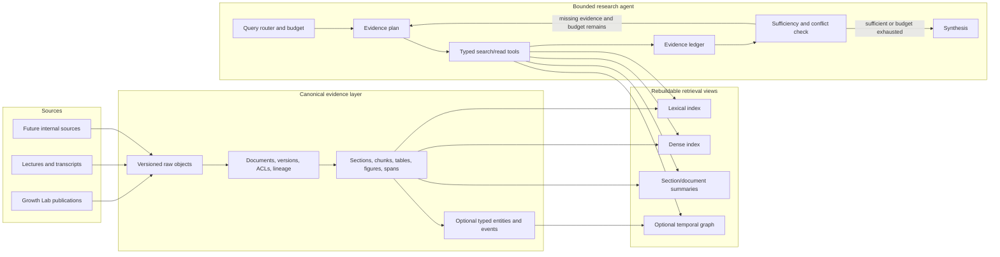

# Modern deep search over organizational documentation

**Architecture survey and redesign recommendation for Growth Lab Deep Search**  
**Research date:** 2026-08-22

## Executive recommendation

Do not replace the current system with a free-roaming autonomous agent, and do not spend the next phase building a knowledge graph. The strongest redesign is a **bounded research agent on top of a high-quality, testable search substrate**:

1. Keep ingestion, permissions, provenance, index maintenance, and retrieval execution deterministic.
2. Give the model a small set of typed search tools and bounded freedom to decompose a question, issue follow-up searches, inspect missing evidence, and stop.
3. Route simple questions through a fast one-pass path; reserve iterative “deep search” for multi-document, historical, comparative, or explicitly exhaustive questions.
4. Treat citations as database-backed evidence spans, not text that the model is trusted to invent.
5. Build evaluation before advanced retrieval. Retrieval is still the main bottleneck in modern enterprise deep-search benchmarks, and no technique wins universally.

For this project, the immediate move should be to **make the existing corpus searchable as a baseline**, then redesign around measurement:

- Fix the lecture-transcript identity collision and index all intended sources.
- Put the existing 29,285 embeddings into a disposable search index and run the current application end to end.
- Create a 100–200 question Growth Lab evaluation set covering lookup, synthesis, historical change, comparison, methods, conflicts, and unanswerable questions.
- Add lexical+dense candidate generation, a real reranker, parent/neighbor expansion, and claim-level citation validation.
- Only then add a query planner and iterative evidence-sufficiency loop.
- Add graph or hierarchical summary indexes only for question classes where the evaluation set proves that ordinary multi-stage retrieval is inadequate.

At the current corpus size—374 extracted documents and 29,285 chunks—the choice between Qdrant and PostgreSQL is not a scale decision. It is an operational decision. The current Qdrant path is close enough to working that it should be used to establish the baseline. The canonical document, version, permission, and evaluation records should live outside the vector index, and the vector index should remain rebuildable. A later Qdrant-versus-PostgreSQL decision can then be made with measured relevance, latency, maintenance, and cost data instead of architecture taste.

## What changed in the field

The 2020–2023 mental model was “chunk documents, embed chunks, retrieve top-*k*, and ask an LLM to answer.” The 2024–2026 mental model is closer to **evidence acquisition under constraints**. A modern system has several retrieval methods, preserves document structure and lineage, and lets a planner decide which method to use and whether more evidence is required.

This change does not mean that vector search is obsolete. It means vector similarity is one tool in a retrieval system rather than the architecture itself.

### The durable pattern

A useful modern decomposition is:

| Layer | Deterministic responsibilities | Model-driven responsibilities |
|---|---|---|
| Corpus | source sync, parsing, versioning, deduplication, ACLs, lineage | optional classification, summaries, entity/event suggestions |
| Indexes | lexical, dense, metadata, parent/child links, optional graph/multimodal views | query rewriting and selection of indexes/tools |
| Research | budgets, tool schemas, concurrency, trace capture, stopping limits | decomposition, search sequencing, gap analysis |
| Answer | evidence IDs, span validation, citation rendering, policy checks | synthesis, comparison, explanation, calibrated abstention |
| Quality | evaluation datasets, metrics, regression gates, audit logs | judge-assisted scoring as one signal, not the sole authority |

That boundary is important. The agent can decide **how to search**, but it should not decide who is authorized, silently change source facts, invent citations, or execute arbitrary retrieval logic.

### What production teams are actually shipping

The best public production accounts are more conservative than the “fully autonomous company brain” pitch:

- Uber’s 2025 security-policy assistant used a sequential workflow: query optimizer, source selector, vector plus BM25 retrieval, deduplication, reconstruction of original chunk order, and answer generation. On an SME-written gold set of more than 100 questions, Uber reports a relative 27% increase in acceptable answers and a relative 60% reduction in incorrect advice. The team also found that generic PDF loaders destroyed tables and built source-specific structured ingestion before claiming the retrieval gain ([Uber Engineering, 2025](https://www.uber.com/co/en/blog/enhanced-agentic-rag/)). This is first-party evidence from one domain, but it is unusually concrete.
- Dropbox Dash separates ordinary RAG from multi-step agents and constrains agent execution through a small, statically checked interpreter rather than unrestricted code. Its architecture also treats granular access control as a core search concern ([Dropbox Engineering, 2025](https://dropbox.tech/machine-learning/building-dash-rag-multi-step-ai-agents-business-users)).
- Elastic’s analysis of one million interactions found a particularly important failure mode: directly relevant retrieved context averaged 9.81/10 on its quality score, no retrieved context averaged 9.18, and tangential context averaged only 8.15. Because this is Elastic’s own scoring framework, the numbers should not be generalized literally; the design lesson is still strong—allow zero results and abstention rather than always filling top-*k* ([Elastic, 2026](https://www.elastic.co/blog/building-ai-agents-elasticsearch-platform)).
- OpenAI’s internal data agent combines retrieved institutional documentation with schema metadata, lineage, historical queries, expert annotations, code-derived semantics, scoped/editable memory, and live warehouse queries. The relevant pattern is routing authoritative structured questions to a structured tool rather than forcing document embeddings to approximate counts and joins ([OpenAI, 2026](https://openai.com/index/inside-our-in-house-data-agent/)).
- Anthropic’s cross-customer guidance distinguishes predictable workflows from agents that dynamically select tools and recommends increasing autonomy only when evaluation justifies the cost and latency ([Anthropic, 2024](https://www.anthropic.com/engineering/building-effective-agents)).

These systems are agentic at the control layer, but heavily engineered and constrained at the data and tool layers.

### Why this is not simply “more agentic”

Recent evidence is sobering:

- A 2025 benchmark of deep search over 39,190 heterogeneous enterprise artifacts found that even its best agentic methods scored only 32.96 on average; the authors identified incomplete retrieval as the main bottleneck ([Choubey et al., EMNLP Industry 2025](https://aclanthology.org/2025.emnlp-industry.34/)).
- EnterpriseRAG-Bench, released in 2026, deliberately includes roughly 500,000 synthetic but cross-consistent artifacts, near-duplicates, conflicts, misfiled documents, and unanswerable questions—conditions that normal QA benchmarks omit ([Sun et al., 2026](https://arxiv.org/abs/2605.05253)). Its value is less the leaderboard than its taxonomy of realistic failure modes.
- A separate August 2026 benchmark reports a large gap between satisfying individual instructions and satisfying all of them at once, plus weak rejection on unanswerable questions and weak conflict recognition ([Miao et al., 2026](https://arxiv.org/abs/2608.11584)). This paper is very recent and should be treated as provisional, but its failure modes are directly relevant.
- Google’s “sufficient context” work finds that strong proprietary models often answer incorrectly rather than abstain when the retrieved evidence is insufficient; explicit sufficiency assessment improves selective accuracy ([Google Research](https://research.google/pubs/sufficient-context-a-new-lens-on-retrieval-augmented-generation-systems/)).

The implication is not “avoid agents.” It is: **make evidence coverage visible, constrain the agent, and evaluate the research trajectory—not just the prose at the end.**

## Current project: what is reusable and what is missing

The project has more reusable infrastructure than its lack of a working search demo suggests.

### Strong assets

- The extraction pipeline is real and has completed a production-scale run: 374 documents, 29,285 embeddings, and zero reported errors in the latest run (`PROJECT_STATUS.md:21`).
- Raw files, extracted text, chunks, embeddings, and ETL tracking are already separated conceptually.
- Marker and Docling backends exist, and the chunk schema has fields for page and section provenance.
- Chunks carry document IDs, page-number fields, section titles, indices, and token counts (`backend/etl/utils/text_chunker.py:53-69`). That is enough to prototype parent/neighbor expansion, although page locators need a separate accuracy audit because the default Marker path does not reliably preserve page boundaries.
- The search layer already performs parallel query fan-out and hybrid dense/BM25 retrieval through Qdrant (`backend/service/agent.py:227-283`; `backend/service/qdrant_service.py:107-137`).
- The LangGraph implementation provides a natural place to add routing, budgets, and evidence-state transitions.
- The FastAPI and Streamlit layers are sufficient for an internal pilot.

### Material gaps

The current service is described as agentic, but its behavior is still a fixed four-node pipeline:

```text
analyze query → retrieve → LLM-grade chunks → synthesize
                         ↘ one broad retry if nothing survives
```

Specific limitations are:

1. **No query-class routing.** Every question gets the same process, whether it is a title lookup, a corpus-wide historical question, or a multi-hop comparison.
2. **No genuine research plan.** Query analysis emits only one to three embedding queries and an optional year (`backend/service/agent.py:58-67`). It does not represent subquestions, evidence requirements, temporal scope, source preferences, or completion criteria.
3. **The retry is not evidence-directed.** If grading removes all chunks, the retry drops all filters and reuses the raw query (`backend/service/agent.py:232-240`, `335-341`). It cannot say, “I found the project name but still need the methodology used in 2018.”
4. **Hybrid fusion is not a reranker.** Qdrant performs reciprocal-rank fusion, after which the agent deduplicates and compares returned scores across rewritten queries. There is no cross-encoder or late-interaction reranking stage, despite README references to Cohere.
5. **Context is discarded twice.** The grader sees at most 1,500 characters per chunk, and synthesis sees at most 2,000 (`backend/service/agent.py:299-304`, `360-369`). There is no parent section, neighboring chunk, table, figure, or full-document expansion.
6. **Citations are model-authored objects.** The model supplies source numbers and “relevant quotes”; the application enriches missing metadata but does not verify that every cited claim is supported by the cited span (`backend/service/agent.py:373-419`).
7. **Metadata filtering is extremely narrow.** Only exact year and document ID filters exist (`backend/service/agent.py:432-453`). There is no author, geography, topic, publication type, date range, source, project, or temporal-validity filter.
8. **The search index is not maintainable yet.** The ingestion script is hard-coded to the Growth Lab embeddings path, excludes OpenAlex and transcripts, deletes and recreates the whole collection (`backend/service/scripts/ingest_to_qdrant.py:70`, `191-207`), builds the full point list in memory, and does not update ingestion status. There are no index manifests, tombstones, aliases, versioned schemas, or atomic swaps.
9. **No end-to-end relevance evaluation exists.** There are unit tests for behavior and seams, but no corpus-based benchmark that measures whether the correct evidence is retrieved and cited.
10. **No authentication or document-level authorization exists.** That is acceptable for today’s public-publication corpus but not for general organizational documentation.
11. **No temporal model exists for organizational history.** Publication year is not enough to distinguish when something happened, when a document was written, what it superseded, or whether two sources conflict.
12. **No production observability exists for search trajectories.** LangSmith is a dependency, but the service does not record query plans, candidates, reranking, evidence gaps, costs, latency, or citation validation.

There are also two immediate data/index blockers: 23 of 24 lecture transcripts are lost because their flat output directory collapses document identity, and no real vector-store instance has ever been populated (`PROJECT_STATUS.md:79-86`).

## Survey of modern techniques

### 1. Hybrid candidate generation remains the default baseline

Dense embeddings capture semantic similarity. Lexical retrieval preserves names, acronyms, exact phrases, dates, program codes, and rare terms. Modern production stacks normally combine them and fuse candidates, then rerank a larger pool.

Anthropic’s contextual-retrieval experiments combined contextualized embeddings, contextualized BM25, and reranking; in its tested datasets, the full combination reduced top-20 retrieval failure from 5.7% to 1.9% ([Anthropic, 2024](https://www.anthropic.com/engineering/contextual-retrieval)). This is vendor-authored evidence, not an independent universal result, but it supports a sound design: enrich isolated chunks with document context, generate candidates broadly, and rerank.

At the same time, EKRAG found that hybrid search and HyDE did not significantly improve its enterprise benchmark while multi-embedding approaches did ([Yu et al., 2025](https://aclanthology.org/2025.knowledgenlp-1.13/)). The apparent contradiction is useful: **hybrid retrieval is the baseline to test, not a guaranteed win.** Results depend on corpus, embedding model, question type, chunking, and the lexical implementation.

Recommended baseline for this project:

- Fetch approximately 50–100 lexical candidates and 50–100 dense candidates per subquery.
- Fuse with reciprocal rank fusion or calibrated scores.
- Deduplicate by canonical document version and near-duplicate content hash.
- Apply metadata/ACL filters before candidates can enter the context.
- Rerank the top 30–80 with a cross-encoder or late-interaction model.
- Select a diverse evidence set under a token budget rather than simply taking the first ten chunks.

### 2. Better chunk context matters more than exotic orchestration

Fixed 500-token chunks are reasonable retrieval anchors, but they should not also be the only answer context. Three techniques now commonly work together:

- **Contextual chunks:** prepend a short document- and section-specific description before embedding and lexical indexing. The original text remains the evidence; the generated context is only a retrieval aid.
- **Parent/child retrieval:** index small child chunks for precision, then return the containing section, neighboring chunks, or table for reading.
- **Multi-granular indexes:** separately index chunks, sections, document abstracts/summaries, and sometimes corpus-level summaries, then route by question type.

RAPTOR demonstrated retrieval across recursively summarized levels of long documents ([Sarthi et al., ICLR 2024](https://proceedings.iclr.cc/paper_files/paper/2024/hash/8a2acd174940dbca361a6398a4f9df91-Abstract-Conference.html)). “Late chunking” embeds the long document before pooling chunk representations so each chunk embedding retains broader context ([Günther et al., 2024](https://arxiv.org/abs/2409.04701)). These are promising options, but both should be tested against the simpler contextual-chunk plus parent-expansion baseline.

For Growth Lab material, the highest-value hierarchy is likely:

```text
publication
  └── section
       ├── paragraph/chunk
       ├── table with title, cells, and page coordinates
       └── figure with caption, OCR/caption text, and page image
```

### 3. Reranking is a separate retrieval stage

Single-vector similarity compresses a query and chunk into one dot product. Cross-encoders and late-interaction models compare query and candidate content more directly and are better suited to a small second-stage candidate pool. ColBERTv2 is the established example of efficient token-level late interaction ([Santhanam et al., 2022](https://aclanthology.org/2022.naacl-main.272/)); Google’s MUVERA work is a newer attempt to make multi-vector retrieval closer to single-vector search cost ([Google Research, 2025](https://research.google/blog/muvera-making-multi-vector-retrieval-as-fast-as-single-vector-search/)).

The practical recommendation is conservative: begin with an off-the-shelf cross-encoder/reranking API or local model. Consider ColBERT-style indexing only if evaluation shows a retrieval ceiling worth the additional storage and operational complexity.

### 4. Long context complements retrieval; it does not replace it

For one identified paper or a small, coherent packet, passing the full document to a long-context model can avoid chunk-boundary failures. For a changing organization-wide corpus, retrieval still provides freshness, filtering, access control, cost control, and provenance.

The 2025 LaRA benchmark found no universal winner between retrieval and long context; performance depended on model, task, context length, and retrieval characteristics ([Li et al., ICML 2025](https://proceedings.mlr.press/v267/li25dv.html)). The correct design is a router:

- Use long context when the relevant document set is already known and fits comfortably.
- Use retrieval when the corpus is large, permissions differ, sources change, or exact provenance matters.
- Use retrieval to identify a small document set, then switch to full-document reading for within-document synthesis.

### 5. Agentic retrieval is an iterative evidence loop

The most useful “agentic” advance is not multi-agent roleplay. It is a stateful loop:

1. Interpret the question and identify required evidence.
2. Decompose into independently searchable subquestions.
3. Search appropriate sources in parallel.
4. Extract and record evidence, entities, dates, and source IDs.
5. Check whether each evidence requirement is satisfied.
6. Search specifically for missing pieces, conflicts, or corroboration.
7. Stop when the evidence is sufficient or the budget is exhausted.
8. Synthesize from the evidence ledger and explicitly state gaps.

Google’s June 2026 enterprise agentic-RAG description uses a planner, query rewriter, RAG agent, and a “sufficient context” agent that returns concrete missing-evidence feedback for another search iteration ([Google Research, 2026](https://research.google/blog/unlocking-dependable-responses-with-gemini-enterprise-agent-platforms-agentic-rag/)). Azure’s agentic retrieval similarly plans subqueries, executes them in parallel, reranks, and packages grounding metadata ([Microsoft, 2025](https://techcommunity.microsoft.com/blog/azure-ai-foundry-blog/introducing-agentic-retrieval-in-azure-ai-search/4414677)). These are vendor sources, but they converge with the research evidence.

The agent should operate under explicit limits: maximum subqueries, maximum iterations, maximum retrieved tokens, time/cost budget, allowed tools, and a required stop reason.

Multi-agent research should be an exceptional, high-value mode, not the default implementation. Anthropic reports strong gains for breadth-first questions with independent search branches, but also reports that its agents use roughly four times the tokens of ordinary chat and its multi-agent system roughly fifteen times the tokens. It also describes coordination, state, evaluation, and deployment complexity ([Anthropic, 2025](https://www.anthropic.com/engineering/multi-agent-research-system)). For this relatively small corpus, a single planner issuing parallel tool calls is the better starting point. Subagents become attractive only when independent research branches exceed one context window and the task value justifies the cost.

### 6. GraphRAG is a specialized index, not the new default

Graph-based retrieval is valuable when the question genuinely depends on relationships or corpus-wide structure: how projects, people, methods, places, and recommendations connect; how an idea propagated; what changed across time; or which sources bridge two topics.

Microsoft GraphRAG exposes different query modes for entity-local questions, corpus-global questions, and DRIFT search ([GraphRAG query overview](https://microsoft.github.io/graphrag/query/overview/)). The distinction is more important than the brand: global summarization is a different information-retrieval task from fact lookup.

However, full GraphRAG has substantial indexing, extraction-quality, update, and graph-drift costs. Microsoft’s own LazyGraphRAG report says its indexing cost is equivalent to vector RAG and about 0.1% of full GraphRAG in its experiments, while offering competitive quality at much lower query cost ([Microsoft Research, 2024; updated 2025](https://www.microsoft.com/en-us/research/blog/lazygraphrag-setting-a-new-standard-for-quality-and-cost/)). This is first-party evidence and should be validated locally.

The right sequence for this project is:

1. multi-query hybrid retrieval with reranking;
2. parent/neighbor expansion and document-level reading;
3. hierarchical document/corpus summaries for broad thematic questions;
4. a **small, typed, temporal graph** only if historical and relational questions still fail.

If a graph is added, start with an ontology that serves known questions: `Person`, `Publication`, `Project`, `Country`, `Method`, `Constraint`, `Recommendation`, and `Event`, with source-backed edges and valid-time fields. Do not ask an LLM to generate an unconstrained universal knowledge graph.

### 7. Organizational history needs temporal and conflict-aware retrieval

“What did the organization believe?” is not the same as “What does the newest document say?” A history-capable system needs at least four dates:

- source creation/publication date;
- date the source entered or changed in the system;
- time period the statement is about;
- validity interval, supersession, or retraction when known.

It also needs canonical entities and document families. Drafts, revised editions, translated copies, slide decks, and final reports should not all count as independent corroboration. The retrieval and synthesis layers should surface disagreements and recency rather than flatten them into one answer.

For the Growth Lab use case, add source-backed `Event` records only for high-value historical claims. Every extracted event should point back to one or more evidence spans. The system can then answer timelines with structured retrieval while still letting users inspect the original publication.

### 8. Structured sources should remain structured

Organizational questions often ask for counts, joins, dates, rankings, project membership, or authoritative definitions. Document retrieval is a poor substitute when the underlying source is a database, catalog, spreadsheet, or API. A modern evidence system routes these questions to a narrowly scoped, read-only structured tool and joins the result with documentary context when necessary.

For this project, that means keeping publication metadata and later project/person/event catalogs queryable independently of embeddings. The agent should be able to ask, for example, for all publications in a date range or all documents associated with a project, then read the relevant sources. It should not receive arbitrary write access or an unrestricted SQL console.

### 9. Indexed and live/federated retrieval can coexist

If future scope includes Google Drive, Slack, GitHub, or other permissioned systems, there are two credible approaches:

- **Normalized index:** better cross-source ranking, deduplication, consistent metadata, and lower query-time dependency on external APIs, but requires incremental sync, permission propagation, and deletion guarantees.
- **Live/federated search:** stronger freshness and native permission fidelity, but inherits each source’s ranking quality, latency, rate limits, filters, and outages.

Slack chose real-time federated calls to external partner APIs, OAuth, and least-privilege scopes so external data and permissions remain current ([Slack Engineering, 2025](https://slack.engineering/how-we-built-enterprise-search-to-be-secure-and-private/)). That is a product-specific security choice, not proof that federation is always superior. The recommended future design is source-specific: index stable publication/document corpora; use live tools for transactional or especially permission-sensitive sources; normalize the results into the same evidence ledger.

### 10. Multimodal document understanding should be conditional

Policy and research PDFs contain tables, charts, maps, equations, and scanned pages. Text-only extraction loses some of their meaning. Modern parsers such as Docling preserve layout, reading order, and table structure ([Docling](https://docling.org/)), and multimodal RAG benchmarks now explicitly measure evidence retrieval across document images and text ([MMDocRAG, 2025](https://proceedings.neurips.cc/paper_files/paper/2025/file/1a93178950e92fd2e7b7448f7d68fd7d-Paper-Datasets_and_Benchmarks_Track.pdf)).

Do not make every query multimodal. Preserve page images and structured tables during ingestion, index captions and table text, and give the research agent a `read_page_image` or `read_table` tool when retrieved evidence indicates that the answer depends on a visual. This limits cost while avoiding irreversible information loss.

### 11. Evaluation is part of the architecture

End-to-end answer scores cannot diagnose whether failure came from parsing, retrieval, reranking, evidence selection, or synthesis. RAGChecker explicitly separates retrieval and generation diagnostics and reports better correlation with human judgments than competing automatic metrics in its meta-evaluation ([Ru et al., NeurIPS 2024](https://proceedings.neurips.cc/paper_files/paper/2024/hash/27245589131d17368cccdfa990cbf16e-Abstract-Datasets_and_Benchmarks_Track.html)). RAGAS is another useful reference-free framework, but automated judges should be calibrated against human-reviewed cases ([Es et al., EACL 2024](https://aclanthology.org/2024.eacl-demo.16/)).

For this project, measure at least:

| Stage | Required measures |
|---|---|
| Corpus | source coverage, parse success, OCR quality, metadata completeness, duplicate/version rates, stale/deleted items |
| Retrieval | evidence recall@*k*, document recall, precision@*k*, MRR/nDCG where applicable, complete/partial/miss for multi-hop evidence |
| Research | subquestion coverage, tool-choice accuracy, iteration count, missing-evidence detection, stop-reason accuracy, cost and latency |
| Answer | factual correctness, completeness, claim support, citation correctness, citation completeness, conflict handling, abstention accuracy |
| Product | user-rated usefulness, time saved, reformulation rate, source-open rate, p50/p95 latency, cost per answer |

The gold set should include hard negatives, near duplicates, changed facts, conflicting sources, missing answers, exact-name queries, broad thematic questions, and questions whose answer is in a table or figure.

### 12. Security and authorization must be retrieval-time controls

If the system expands beyond public publications, access control must be propagated from source to index and applied before candidates reach the model. A prompt instruction to “respect permissions” is not authorization. Azure’s document-level access-control documentation is one current example of storing permission metadata and trimming results at query time ([Microsoft Learn, 2026](https://learn.microsoft.com/en-us/azure/search/search-document-level-access-overview)).

Retrieved documents are also untrusted input. OWASP’s 2025 guidance explicitly notes that RAG does not remove prompt-injection risk and gives the example of a poisoned repository document influencing the model ([OWASP LLM01](https://genai.owasp.org/llmrisk/llm01-prompt-injection/); [RAG Security Cheat Sheet](https://cheatsheetseries.owasp.org/cheatsheets/RAG_Security_Cheat_Sheet.html)). A read-only research agent is safer than an agent that can act, but it can still leak data or distort answers.

Minimum controls are:

- query-time ACL filtering, with ACL changes and deletions synchronized to every derived index;
- tenant/security-domain boundaries where filtering alone is not a sufficient guarantee;
- source allowlists and provenance on every evidence item;
- explicit separation of retrieved content from system instructions;
- no action-capable tools in the documentation-search agent;
- prompt-injection tests in the evaluation set;
- complete audit logs of principal, query, retrieved IDs, and cited evidence;
- output handling that does not execute model-generated markup, code, URLs, or queries.

### 13. Maintenance is a first-class subsystem

The hidden long-term work is not prompting. It is keeping the evidence layer truthful:

- connector/API changes, retries, and rate limits;
- incremental sync and freshness service-level objectives;
- deletion and tombstone propagation to chunks, summaries, caches, and graphs;
- permission and group-membership synchronization;
- duplicate, translation, draft, and superseded-version handling;
- re-parsing and re-embedding migrations when models or schemas change;
- index/schema aliases and rollback;
- monitoring source coverage, retrieval drift, latency, and cost.

Every derived artifact should carry the source hash plus parser, chunker, embedding, prompt/model, and taxonomy versions that created it. A build should produce a validated index manifest. This prevents the current file-existence resume logic from mistaking stale artifacts for compatible ones.

## Architecture alternatives considered

| Approach | Best fit | Main weakness | Decision here |
|---|---|---|---|
| Fixed one-pass RAG | routine lookup, low latency | poor multi-hop coverage; weak gap detection | retain as fast mode |
| Bounded single research agent | mixed enterprise questions; controllable deep search | more latency and evaluation surface than one pass | **recommended default architecture** |
| Multi-agent research | expensive breadth-first investigations with independent branches | high token use, coordination, state, and reliability costs | optional future premium mode |
| Graph-first RAG | stable ontology and genuinely relational/global questions | expensive/noisy extraction, drift, update and ACL complexity | defer pending evaluation |
| Long-context-only | one known document or very small stable corpus | cost, distraction, freshness, ACL, and corpus-size limits | use after document routing |
| Fully federated live search | highly dynamic, source-permissioned systems | cross-source ranking, API latency/rate limits, inconsistent metadata | use selectively by source |

The recommended system is intentionally compositional: fast RAG and long-context reading become tools within the bounded architecture rather than competing rewrites of the whole application.

## Recommended target architecture



### Canonical evidence model

Use a relational/catalog layer as the system of record even if Qdrant remains the search engine. Suggested core records:

- `source_item`: connector, native ID, source URL, ACL/security domain, sync cursor, deletion state;
- `document`: stable document family, canonical title, organization-specific type;
- `document_version`: content hash, source dates, ingestion dates, supersedes/retracted relationships, parser/index versions;
- `evidence_unit`: immutable span ID, parent/neighbor IDs, page/coordinates, section path, text, unit type, quality score;
- `derived_artifact`: embedding model/version, contextual prefix, summary, tags, entity/event extraction, confidence, prompt/model/taxonomy version;
- `index_manifest`: corpus snapshot, schema version, embedding version, build time, row counts, validation status;
- `research_trace`: principal, question, plan, tool calls, candidate/rerank results, evidence ledger, answer, citations, latency, tokens, cost;
- `feedback/evaluation`: gold answers and evidence, human ratings, automated scores, production feedback.

Generated tags and summaries must be labeled as derived artifacts. They should never overwrite source metadata or be presented as if the organization authored them.

### Query modes

Expose one search box but route internally:

| Mode | Typical question | Process |
|---|---|---|
| Lookup | “Which paper introduced X?” | one hybrid search, rerank, answer |
| Document reading | “Summarize the method in this report” | identify document, read full relevant sections/long context |
| Synthesis | “What does the Growth Lab say about industrial policy?” | query fan-out, diverse document selection, evidence ledger |
| Historical | “How did recommendations change from 2010 to 2025?” | temporal filters, document families, iterative retrieval, conflict/change synthesis |
| Relational/multi-hop | “Which projects used methods developed in earlier papers?” | iterative entity resolution; optional graph expansion |
| Corpus-global | “What themes dominate the full archive?” | document/section summaries or offline analytical index, not top-*k* chunks alone |
| Unanswerable | question not supported by corpus | explicit coverage check and abstention with searched scope |

Users should be able to choose `Fast`, `Standard`, or `Deep`, while the router proposes a default. “Deep” should mean more evidence work and a documented trace, not simply a larger model.

### Typed tools for the agent

Start with a small tool surface:

- `search_chunks(query, filters, candidate_k)`
- `search_documents(query, filters, candidate_k)`
- `search_metadata(authors, years, countries, methods, source_types)`
- `read_section(section_id)`
- `expand_context(evidence_unit_id, before, after, parent)`
- `read_document(document_version_id, section_filter)`
- `read_table(table_id)` / `read_page(page_id)`
- `find_related(entity_or_document_id, relation_types)` only after a graph exists

Every result should return immutable evidence IDs, source/version metadata, scores by retrieval stage, and ACL-safe display links. The planner should never receive a raw database or arbitrary query tool.

### Evidence ledger and citation contract

The evidence ledger is the key new state object. Each row should include:

- subquestion/evidence requirement;
- extracted claim or fact;
- exact evidence span IDs;
- document/version/date;
- whether it corroborates, contradicts, or merely contextualizes;
- confidence/quality notes;
- unresolved gaps.

Synthesis may cite only ledger evidence. A post-generation validator should map every factual claim to one or more spans, reject nonexistent quotes, and render page/section links from stored metadata. If a claim lacks support, the system should revise or remove it.

## Storage recommendation: Qdrant now, portability by design

The current repository frames Qdrant versus pgvector as a decision that must precede ingestion. It does not need to be irreversible.

### Recommended decision

1. **Use Qdrant for the first measured baseline** because the collection schema, ingestion code, hybrid search, and service wrapper already exist.
2. **Do not make Qdrant the system of record.** Keep canonical documents, versions, lineage, and later ACLs in PostgreSQL or another durable catalog plus object storage.
3. Define a narrow retrieval interface and versioned index manifest so Qdrant can be rebuilt or replaced.
4. Benchmark a PostgreSQL implementation only after the gold evaluation set exists.

At 29,285 chunks, PostgreSQL with pgvector is easily within a plausible operating range and may reduce infrastructure. However, standard PostgreSQL full-text ranking is not automatically equivalent to BM25, extension availability varies in managed Cloud SQL, and combining lexical, vector, filtering, and reranking still requires engineering. Qdrant offers the current project a shorter path to a real baseline. Neither choice fixes poor parsing, missing evidence, weak reranking, or lack of evaluation.

Selection criteria for a later bake-off:

- recall and ranking on the Growth Lab gold set;
- exact metadata and future ACL filtering;
- incremental update/delete/version behavior;
- support for multiple vectors and payload/index schema evolution;
- operational burden, backup/restore, monitoring, and cost;
- latency under concurrent research fan-out;
- ease of reconstructing a cited result from canonical evidence.

## Recommendation on PR #51 (LLM document tagging)

Do **not** make PR #51 a prerequisite for indexing the corpus. Its taxonomy may help filtering and query routing, but requiring it now would mix three unmeasured changes: retrieval baseline, new generated metadata, and a fixed ontology.

Salvage the work as a versioned enrichment job with these changes:

- store tags as derived annotations with model, prompt, taxonomy version, timestamp, and confidence;
- preserve human/source metadata separately;
- allow multiple taxonomy versions and reprocessing without rewriting original chunks;
- use multi-label values and an `unknown/other` path;
- evaluate tag precision/recall on a human-labeled sample;
- test whether tags improve retrieval or accidentally filter out relevant evidence;
- prefer soft reranking boosts over hard filters unless the user explicitly requests a filter.

The same enrichment framework can later support entities, methods, countries, constraints, recommendations, and event extraction.

## Phased implementation plan

### Phase 0: recover a truthful baseline (approximately 1–2 weeks)

- Fix transcript IDs and index the 24 transcripts distinctly.
- Stand up Qdrant locally and in a disposable hosted environment.
- Make ingestion incremental and idempotent; stop deleting the active collection in place.
- Add an index manifest and an atomic collection alias/swap.
- Run raw search, agent search, and the frontend against the real corpus.
- Record 30–50 representative failures before changing retrieval.

**Exit criterion:** the current system answers real queries, returns inspectable source passages, and can be rebuilt repeatably from a named corpus snapshot.

### Phase 1: build evaluation and the strong non-agentic baseline (approximately 2–4 weeks)

- Create 100–200 expert-reviewed questions and gold evidence spans.
- Add question categories and answerability labels.
- Measure parsing coverage and dense-only, lexical-only, and hybrid retrieval separately.
- Add candidate pooling, reranking, near-duplicate/version control, and parent/neighbor expansion.
- Replace model-invented citations with immutable evidence IDs and span validation.
- Add traces and dashboards for retrieval, latency, and cost.

**Exit criterion:** retrieval and citation regressions fail CI or a scheduled evaluation, and the team knows the main failure modes by question class.

### Phase 2: bounded deep-search agent (approximately 3–5 weeks)

- Add fast/standard/deep routing.
- Introduce a structured evidence plan and ledger.
- Provide typed search/read tools.
- Add evidence sufficiency, conflict detection, and targeted follow-up searches.
- Set iteration, time, token, and cost budgets with explicit stop reasons.
- Stream the plan and sources to the UI so users can inspect progress.

**Exit criterion:** deep mode materially improves multi-document and historical questions without degrading citation support, abstention, latency, or cost beyond agreed budgets.

### Phase 3: specialized indexes only where justified

- Add document/section summaries for corpus-global questions.
- Add table/page-image retrieval for visual evidence failures.
- Add a typed temporal entity/event graph for demonstrated multi-hop or history gaps.
- Add connectors and ACL propagation if internal sources enter scope.

**Exit criterion:** every new index demonstrates an improvement on a named question slice large enough to justify its maintenance burden.

## What not to do

- Do not hand the model unrestricted SQL, filesystem, or arbitrary retrieval code.
- Do not use “multi-agent” as a substitute for an evidence-state model; separate agents add latency and new failure boundaries.
- Do not generate a full knowledge graph before identifying questions that require graph traversal.
- Do not re-embed the entire corpus for every retrieval idea. Keep raw evidence and derived indexes versioned and independently rebuildable.
- Do not hard-filter on LLM-generated tags until their false-negative rate is measured.
- Do not judge the system from a handful of impressive demo questions.
- Do not collapse conflicting or revised documents into one timeless “company answer.”
- Do not let an answer cite a title or model-generated quote without an exact retrievable span.
- Do not treat a longer context window as permission to skip retrieval, authorization, or provenance.

## Practitioner evidence and cautions

Forum evidence is anecdotal and often self-promotional, but several themes recur strongly enough to guide what to test:

- A widely discussed 2025 practitioner post based on roughly ten enterprise implementations says extraction-quality routing and poor legacy PDFs mattered more than embedding upgrades ([Reddit discussion](https://www.reddit.com/r/LLMDevs/comments/1n98lsf/building_rag_systems_at_enterprise_scale_20k_docs/)). This is consistent with the project’s own expensive OCR pipeline and the need for document-quality metrics.
- Practitioners repeatedly call out duplicates, document versions, dates, and metadata as production problems rather than vector-search problems ([Enterprise RAG AMA](https://www.reddit.com/r/Rag/comments/1knr136/author_of_enterprise_rag_herehappy_to_dive_deep/)). Claims in the thread are not independently verified, but the failure modes are credible and testable.
- A 2026 GraphRAG discussion shows no consensus: some users report large deployments, while others emphasize extraction noise, graph drift, and the fact that graphs pay off for multi-hop questions rather than corpus size alone ([Reddit discussion](https://www.reddit.com/r/Rag/comments/1svm8mc/graph_rag_anyone_actually_scaled_it_past_a_few/)). This supports a benchmark-gated graph decision.
- Evaluation discussions commonly recommend a small human-reviewed set before trusting LLM-as-judge scores ([Reddit discussion](https://www.reddit.com/r/Rag/comments/1fjyx66/how_to_measure_rag_accuracy/)). That advice aligns with RAGChecker’s formal separation of retrieval and generation metrics.
- Table-extraction discussions remain mixed and document-specific; layout and cell relationships are still common failure points even with multimodal models ([Reddit r/MachineLearning discussion](https://www.reddit.com/r/MachineLearning/comments/1jnjfaq/d_why_is_table_extraction_still_not_solved_by/)). Preserve structure and page images rather than betting on one universal parser.

These discussions should influence test cases, not be treated as proof of a particular product or architecture.

## Decision summary

| Decision | Recommendation | Revisit when |
|---|---|---|
| Agent autonomy | bounded planner with typed tools and budgets | trajectory eval shows under- or over-searching |
| Vector store | Qdrant for baseline; rebuildable and portable | gold set and production workload support a bake-off |
| Retrieval | lexical+dense candidates, rerank, expand context | per-query-class evaluation suggests alternatives |
| Chunking | retain small anchors; add contextual and parent views | baseline ablation identifies better granularity |
| Long context | route to it for known documents/small packets | model/cost/context characteristics change |
| GraphRAG | defer; begin with typed temporal graph only if justified | historical/multi-hop slice remains weak |
| LLM tagging PR | versioned optional enrichment, not a gate | human labeling and retrieval ablation show value |
| Multimodal | preserve assets now; invoke selectively | table/figure slice quantifies demand |
| Citations | evidence-span IDs with post-generation validation | never relax for convenience |
| Evaluation | build before advanced orchestration | continuously expand from production failures |

## Research method and source quality

This survey combined:

- inspection of the repository’s ETL, search, service, frontend, tests, status document, open issues, and PR #51;
- recent peer-reviewed or conference-published work on enterprise RAG, retrieval, long context, graph/hierarchical retrieval, and evaluation;
- official engineering/research material from Anthropic, Google, Microsoft, OpenAI, OWASP, and Docling;
- recent practitioner discussions on Reddit, treated explicitly as anecdotal evidence.

The search emphasized 2024–2026 developments, with older work included only where it remains foundational. Vendor benchmarks were not treated as neutral comparisons. Very recent 2026 preprints and synthetic enterprise benchmarks were used to identify failure modes, not to claim settled rankings. Scholarly titles and publication metadata were cross-checked against primary proceedings pages, DOI records, arXiv, OpenAlex, Crossref, or Semantic Scholar where available.

### Search coverage and reproducibility

Research was split across four angles:

1. **Architecture and research:** enterprise deep-search benchmarks; adaptive/agentic retrieval; query decomposition; sufficient-context and abstention; hybrid/multi-vector retrieval and reranking; long context; hierarchical and graph retrieval; multimodal document QA; evaluation.
2. **Production engineering:** public accounts from Uber, Dropbox, Elastic, Slack, Anthropic, Google, Microsoft, OpenAI, IBM/Docling, and search-platform documentation.
3. **Practitioner experience:** Reddit communities including r/Rag, r/LLMDevs, r/LocalLLaMA, and r/MachineLearning, plus Hacker News discussions on contextual retrieval, long context, GraphRAG, and large-scale production RAG.
4. **Project fit:** direct inspection of the repository, its current status, open GitHub issues, PR #51, ETL/chunk/embedding artifacts, ingestion code, retrieval agent, API, frontend, tests, and deployment configuration.

Representative search formulations included “enterprise deep search heterogeneous documents benchmark,” “agentic RAG sufficient context query planning,” “RAG versus long context routing,” “GraphRAG global local cost,” “enterprise RAG ACL security trimming,” “production RAG lessons documents Reddit,” and “RAG evaluation retrieval recall citation faithfulness.” Academic discovery used primary proceedings and arXiv, followed by DOI/title verification through Crossref, OpenAlex, and Semantic Scholar. Ten central scholarly citations were run through an automated literature-verification workflow; nine resolved automatically, while the GraphRAG preprint was checked through arXiv/Microsoft primary sources and was not used for a fragile bibliographic claim.

## Selected sources

### Research and benchmarks

- Choubey, P. K., et al. (2025). [Benchmarking Deep Search over Heterogeneous Enterprise Data](https://aclanthology.org/2025.emnlp-industry.34/). EMNLP Industry 2025. DOI: `10.18653/v1/2025.emnlp-industry.34`.
- Li, K., et al. (2025). [LaRA: Benchmarking Retrieval-Augmented Generation and Long-Context LLMs—No Silver Bullet for LC or RAG Routing](https://proceedings.mlr.press/v267/li25dv.html). ICML 2025.
- Yu, T., et al. (2025). [EKRAG: Benchmark RAG for Enterprise Knowledge Question Answering](https://aclanthology.org/2025.knowledgenlp-1.13/).
- Miao, H., et al. (2026). [EnterpriseRAG: Benchmarking LLM Instruction Adherence and Robustness under Non-Ideal Enterprise Retrieval](https://arxiv.org/abs/2608.11584). Preprint.
- Sun, Y., et al. (2026). [EnterpriseRAG-Bench: A RAG Benchmark for Company Internal Knowledge](https://arxiv.org/abs/2605.05253). Preprint and open benchmark.
- Ru, D., et al. (2024). [RAGChecker: A Fine-grained Framework for Diagnosing Retrieval-Augmented Generation](https://proceedings.neurips.cc/paper_files/paper/2024/hash/27245589131d17368cccdfa990cbf16e-Abstract-Datasets_and_Benchmarks_Track.html). NeurIPS 2024.
- Es, S., et al. (2024). [RAGAS: Automated Evaluation of Retrieval Augmented Generation](https://aclanthology.org/2024.eacl-demo.16/). EACL 2024.
- Sarthi, P., et al. (2024). [RAPTOR: Recursive Abstractive Processing for Tree-Organized Retrieval](https://proceedings.iclr.cc/paper_files/paper/2024/hash/8a2acd174940dbca361a6398a4f9df91-Abstract-Conference.html). ICLR 2024.
- Santhanam, K., et al. (2022). [ColBERTv2: Effective and Efficient Retrieval via Lightweight Late Interaction](https://aclanthology.org/2022.naacl-main.272/). NAACL 2022.
- Günther, M., et al. (2024). [Late Chunking: Contextual Chunk Embeddings Using Long-Context Embedding Models](https://arxiv.org/abs/2409.04701). Preprint.

### Primary engineering and safety sources

- Anthropic (2024). [Contextual Retrieval](https://www.anthropic.com/engineering/contextual-retrieval).
- Anthropic (2024). [Building Effective AI Agents](https://www.anthropic.com/engineering/building-effective-agents).
- Anthropic (2025). [How We Built Our Multi-Agent Research System](https://www.anthropic.com/engineering/multi-agent-research-system).
- Google Research (2026). [Agentic RAG with sufficient-context iteration](https://research.google/blog/unlocking-dependable-responses-with-gemini-enterprise-agent-platforms-agentic-rag/).
- Google Research. [Sufficient Context: A New Lens on RAG Systems](https://research.google/pubs/sufficient-context-a-new-lens-on-retrieval-augmented-generation-systems/).
- Microsoft Research. [GraphRAG query modes](https://microsoft.github.io/graphrag/query/overview/) and [LazyGraphRAG cost/quality experiments](https://www.microsoft.com/en-us/research/blog/lazygraphrag-setting-a-new-standard-for-quality-and-cost/).
- Microsoft (2025). [Agentic retrieval in Azure AI Search](https://techcommunity.microsoft.com/blog/azure-ai-foundry-blog/introducing-agentic-retrieval-in-azure-ai-search/4414677).
- OpenAI (2025). [Deep research system card](https://openai.com/index/deep-research-system-card/), especially the description of multi-step search and risks from browsing untrusted material.
- OpenAI (2026). [Inside OpenAI’s In-House Data Agent](https://openai.com/index/inside-our-in-house-data-agent/).
- Uber Engineering (2025). [Enhanced Agentic-RAG](https://www.uber.com/co/en/blog/enhanced-agentic-rag/).
- Dropbox Engineering (2025). [Building Dash with RAG and AI Agents](https://dropbox.tech/machine-learning/building-dash-rag-multi-step-ai-agents-business-users).
- Elastic (2026). [Building Production AI Agents on Elasticsearch: Five Lessons](https://www.elastic.co/blog/building-ai-agents-elasticsearch-platform).
- Slack Engineering (2025). [How We Built Enterprise Search to Be Secure and Private](https://slack.engineering/how-we-built-enterprise-search-to-be-secure-and-private/).
- OWASP (2025–2026). [Prompt Injection](https://genai.owasp.org/llmrisk/llm01-prompt-injection/) and [RAG Security Cheat Sheet](https://cheatsheetseries.owasp.org/cheatsheets/RAG_Security_Cheat_Sheet.html).
